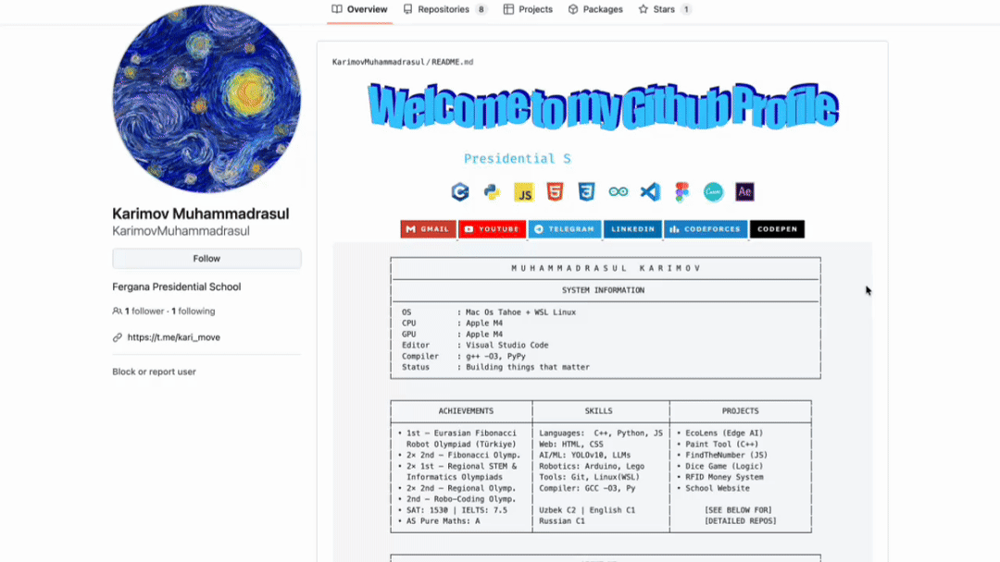
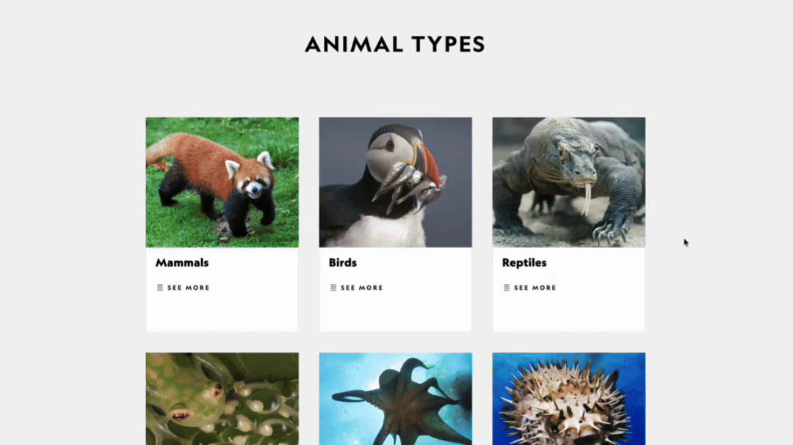

# SelectToAsk AI

A local multimodal extension for Chrome. It allows you to select any part of your browser window to ask questions about what you’re seeing. No data leaves your machine, and everything runs on local hardware.

---

<table border="0" style="width:100%; border-collapse:collapse;">
  <tr>
    <td style="width:50%; padding:5px;">
      
    </td>
    <td style="width:50%; padding:5px;">
      
    </td>
  </tr>
</table>

## How it works

### 1. Selection

Activate the interface with `Cmd+Shift+Y`. Drawing a rectangle over an area captures the visual context. I built the selection layer using a transparent canvas to keep the interaction fluid and precise.

### 2. Vision & Reasoning

The captured pixels are sent to a local **LLaVA** instance via Ollama. It interprets the image and provides an answer within a minimalist, floating UI.

### 3. Memory & Follow-ups

The system maintains a conversation buffer. You can ask follow-up questions about the same image without re-selecting it, allowing for a more natural dialogue with the visual data.

---

## Design Choices
I wanted the UI to feel like a native part of macOS. It uses a "Liquid Glass" effect to stay legible without blocking the content behind it. During the selection process, a subtle gradient glow indicates that the model is active, inspired by Apple design patterns.

---

## Scalability
The project is currently configured for local testing to ensure privacy and zero cost. 
* **Local:** Users run the model via Ollama.
* **Future:** The architecture is decoupled. To scale this for users without high-end GPUs, the local endpoint can be swapped for a cloud-hosted inference server (like vLLM), though this would introduce subscription costs to cover the GPU compute.

---

## Setup

1. **Model:** Install [Ollama](https://ollama.com) and run `ollama pull llava`.
2. **CORS:** Chrome extensions require specific permissions to talk to local servers. Restart Ollama with:
   `OLLAMA_ORIGINS="chrome-extension://*" ollama serve`
3. **Install:** * Open `chrome://extensions`
   * Enable **Developer Mode**
   * Click **Load Unpacked** and select this project folder.

